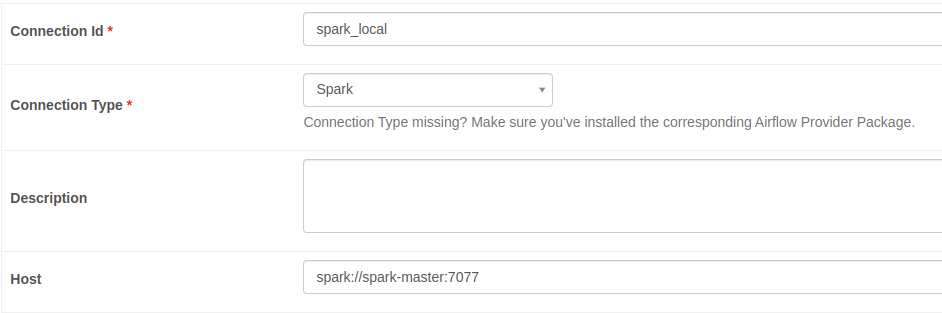

# airflow-spark-jobs

## Prerequisites

This Setup was tested on Ubuntu 20.04.

- **docker (Version 20.10.14)**

  Get the Docker engine community edition following the steps in the official documentation [here](https://docs.docker.com/install/linux/docker-ce/ubuntu/).

- **docker-compose (Version 1.29.2)**

  Install docker compose which relies on docker engine following the steps [here](https://docs.docker.com/compose/install/).

### Initializing environment for Airflow 

- Create directories 
  
  ``` mkdir -p ./dags ./logs ./plugins ```

- Set Airflow UID 

  ``` echo -e "AIRFLOW_UID=$(id -u)" > .env ```
  
  Update in the docker-compose the variable ```AIRFLOW_UID``` with the result of ```id -u ```. In our case it is set to *1000*
  
- Initialize the database 

  ``` docker-compose up airflow-init ```
  
For more information check Airflow's [documentation](https://airflow.apache.org/docs/apache-airflow/stable/start/docker.html). 

## Start Services

You can start all the services by running ```docker-compose up -d```

Access the Airflow web interface at: http://localhost:8080. The default account has the login *airflow* and the password *airflow*.

## Create new Spark Connection

Go to Airflow web interface under *Admin -> Connection -> Add new connection* and add a new Spark connection like shown below: 

